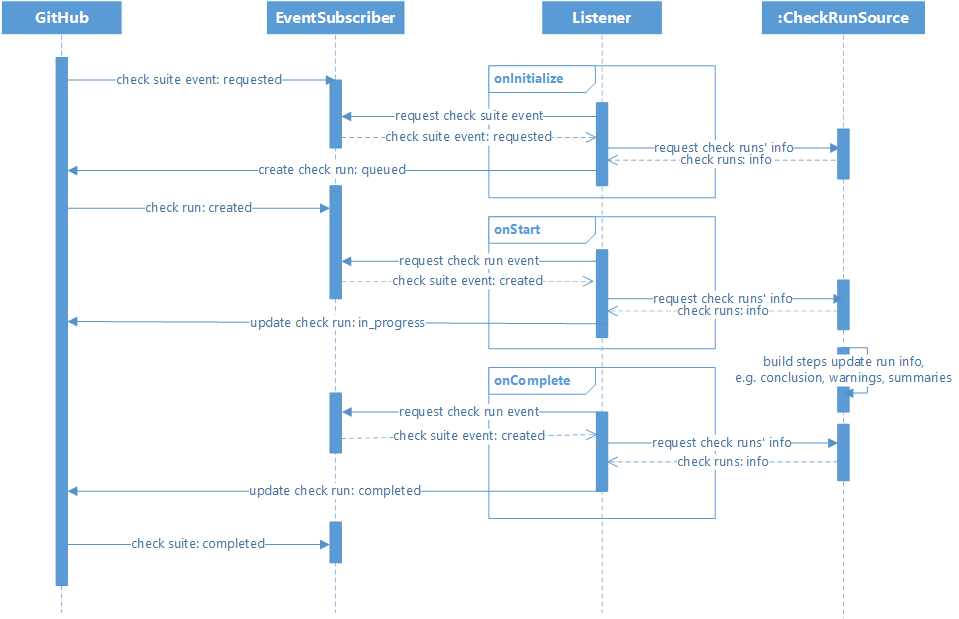

# POC: Jenkins Checks API Plugin

This repository is a POC of GitHub checks API in Jenkins.

## Usage
### Jenkins as GitHub APP
This plugin converts Jenkins into a [GitHub APP](https://developer.github.com/apps/about-apps/) 
by allowing users to input their registered APP information (id, title, private key) in
Jenkins global configuration page.

### Jenkins Runs as Check Suites
This plugin creates check suites and check runs in GitHub based on Jenkins runs 
by implementing a GitHub event subscriber and a Jenkins run listener. Note that 
one Jenkins run can create multiple check runs, so a Jenkins run can be seen as 
a check suite. As for the builders, publishers, or other components involving in a 
Jenkins run, they can be seen as independent check runs as long as they extend the corresponding
extension points. For now, we see a check run belongs to a Jenkins run if they contain the
same GitHub repository URL.

## Basic Workflow
The GitHub checks events and Jenkins runs are connected by a simple message queue (may need a huge improvement
later). Whenever Jenkins receives a check suite or check run event, the event subscriber will
store it in the message queue. Thus, later when a Jenkins run triggers the run listener, it can retrieve 
a GitHub event from the message queue to gain the information of check suites and runs. Then, the listener 
will change the check runs' state (queued, in_progress, completed) according to the current Jenkins run's state 
(initialize, start, complete) through several http requests.

## Extension
Any plugins that want to create a check run need to extend `CheckRunSource`. This allows them to provide names or 
other information to a check run. When a Jenkins run is initialized, the run listener will create several 
check runs based on extended sources. In order to let other plugins be able to update information 
(like status, conclusion, and summaries), it will also attach these sources to the run through 
`CheckRunAction`.

## Current Flaws
* The checks run status on the GitHub page may not at the same pace as Jenkins run. This situation may happen when the
 network condition is not very good. For example, if the Jenkins run has triggered the `onStart` event of the listener, 
 while our subscriber has not received the check run `created` event from GitHub yet, then the listener may not be able to
 update the check run into `in_progress` status. In other words, our subscriber has nowhere to find the check run id and URL
 to update it because of the delayed `created` event. But luckily, our Jenkins run may work for a while, 
 so by the time when it finishes and triggers the `onCompelte` event of the listener, the subscriber 
 should have already received the `created` event from GitHub and put it into the message queue. Thus, 
 the listener is able to update the check runs into `complete` status and attach conclusions or summaries.
* As mentioned above, currently we match a Jenkins run to a check suite and several checks runs as long as they contain the same GitHub repository URL. I'm sure whether it is the best way 
  and if we can find a better approach to do this map job, we may use hash maps instead of message queues
  to improve efficiency.
* If we still have to use the message queue eventually, we may have to improve it in several aspects: **consistency**, 
concurrency, functionaries, etc.

## To Do
* Simplify code, many redundant code exist and I repeat myself a lot :sweat_smile:.
* Left many works inside `Listener` is not very good, need to clarify the specific works for these classes.
* Due to the current incomplete support from [GitHub API Plugin](https://github.com/jenkinsci/github-api-plugin) (see [ISSUE#520](https://github.com/github-api/github-api/issues/520) 
and [PR#723](https://github.com/github-api/github-api/pull/723)), I parse the payload and make requests myself. Later 
when the checks API is fully supported, I will transfer the project to it.

## Other Attempts
* I‘m also thinking about whether we can implement it in [observer pattern](https://en.wikipedia.org/wiki/Observer_pattern). 
  We define a subject, interfaces, and some other tools for creating/updating check runs. When an event comes, we can call 
  the method (like create() in the interface) implemented by the observers. This can increase the extensibility 
  because the plugin itself is no longer responsible for creating/updating those checks entities, but delegate to others.
  But problems still exist for this solution, since the event is independent of the Jenkins run status.
