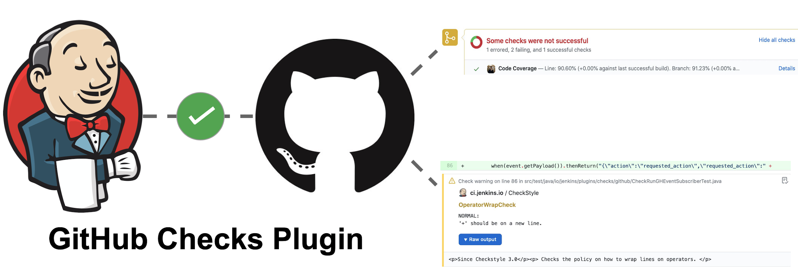

# GitHub Checks API Plugin

This plugin publishes checks to GitHub through [GitHub Checks API](https://docs.github.com/en/rest/reference/checks#runs).
It implements the extension points defined in [Checks API Plugin](https://github.com/jenkinsci/checks-api-plugin). 

This plugin has been installed, alone with the [General API Plugin](https://github.com/jenkinsci/checks-api-plugin) on [ci.jenkins.io](https://ci.jenkins.io/Plugins) to help maintain over 1500 Jenkins plugins. You can take a look at the [action](https://github.com/jenkinsci/github-checks-plugin/runs/1025018883) for this repository or other plugin repositories under [Jenkins organization](https://github.com/jenkinsci) for the results.

## Features

*Prerequsite: only GitHub App with proper permissions can publish checks, this [guide](https://github.com/jenkinsci/github-branch-source-plugin/blob/master/docs/github-app.adoc) helps you authenticate your Jenkins as a GitHub App.*

### Build Status Check

By listening to the Jenkins builds, this plugin will automatically publish statuses (pending, in progress, and completed) to GitHub.

*Note: If you are using [GitHub Branch Source Plugin](https://github.com/jenkinsci/github-branch-source-plugin), it will also send status notifications to GitHub through [Status API](https://docs.github.com/en/rest/reference/repos#statuses).
You can disable it by using [Disable GitHub Multibranch Status Plugin](https://github.com/jenkinsci/disable-github-multibranch-status-plugin) or [Skip Notification Trait Plugin](https://github.com/jenkinsci/skip-notifications-trait-plugin).*

### Rerun Failed Build

If your Jenkins build failed, a failed check will be published here.
A "Re-run" button will be added automatically by GitHub, by clicking it, you can schedule a new build for the **last** commit of this branch.

## Contributing

Refer to our [contribution guidelines](https://github.com/jenkinsci/.github/blob/master/CONTRIBUTING.md)

## Acknowledgements

This plugin was started as a [Google Summer of Code 2020 project](https://summerofcode.withgoogle.com/projects/#5139745388101632), special thanks to the support from [Jenkins GSoC SIG](https://www.jenkins.io/sigs/gsoc/) and the entire community.

## LICENSE

Licensed under MIT, see [LICENSE](LICENSE)