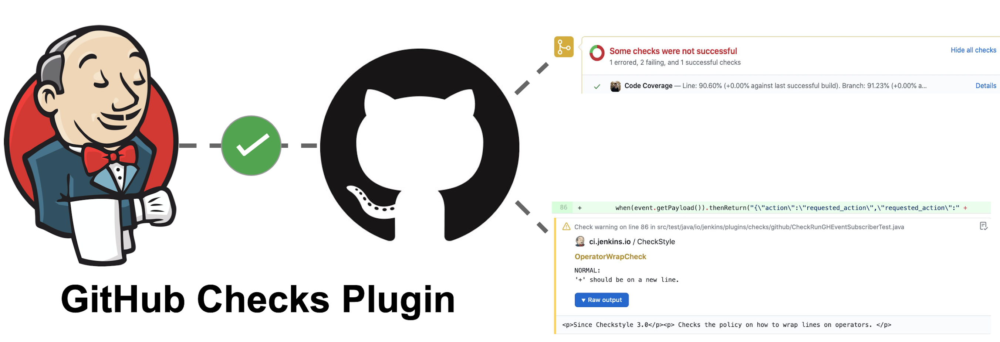
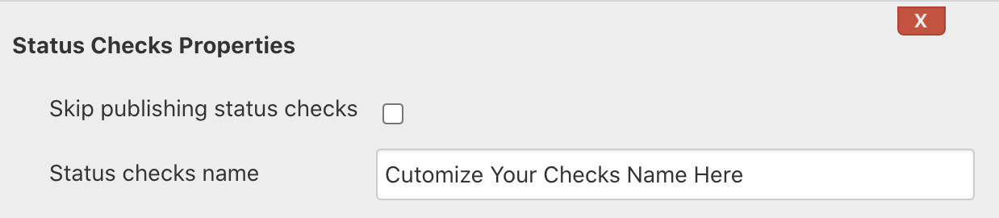
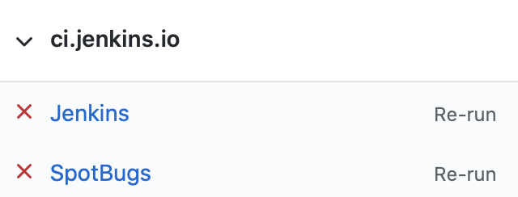
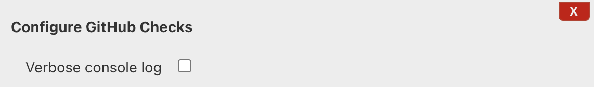

# GitHub Checks API Plugin

[](https://gitter.im/jenkinsci/github-checks-api)
[](https://github.com/jenkinsci/github-checks-plugin/issues)
[](https://ci.jenkins.io/job/Plugins/job/github-checks-plugin/job/master/)
[](https://github.com/jenkinsci/github-checks-plugin/actions)
[](https://www.codacy.com/gh/jenkinsci/github-checks-plugin?utm_source=github.com&amp;utm_medium=referral&amp;utm_content=jenkinsci/github-checks-plugin&amp;utm_campaign=Badge_Grade)
[](https://codecov.io/gh/jenkinsci/github-checks-plugin)



This plugin publishes checks to GitHub through [GitHub Checks API](https://docs.github.com/en/rest/reference/checks#runs).
It implements the extension points defined in [Checks API Plugin](https://github.com/jenkinsci/checks-api-plugin). 

This plugin has been installed, along with the [Checks API Plugin](https://github.com/jenkinsci/checks-api-plugin) on [ci.jenkins.io](https://ci.jenkins.io/Plugins) to help maintain over 2000 Jenkins plugins. You can take a look at the [check runs](https://github.com/jenkinsci/github-checks-plugin/runs/71009019003) for this repository or other plugin repositories under [Jenkins organization](https://github.com/jenkinsci) for the results.

- [Features](#features)
  - [Build Status Check](#build-status-check)
  - [Multiple jobs on one repository](#multiple-jobs-on-one-repository)
  - [Which commit a check is published against](#which-commit-a-check-is-published-against)
  - [Rerun Failed Build](#rerun-failed-build)
 - [Contributing](#contributing)
 - [Acknowledgements](#acknowledgements)
 - [LICENSE](#license)

## Getting started

Only GitHub Apps with proper permissions can publish checks, this [guide](https://github.com/jenkinsci/github-branch-source-plugin/blob/master/docs/github-app.adoc) helps you authenticate your Jenkins instance as a GitHub App. 
The permission *read/write* on *Checks* needs to be granted in addition to the ones already mentioned in the guide.

## Features

### Build Status Check


This plugin implements [the status checks feature from Checks API Plugin](https://github.com/jenkinsci/checks-api-plugin#build-status-check) to publish statuses (pending, in progress, and completed) to GitHub.

You can customize it by configuring the "Status Checks Properties" behavior for your GitHub SCM Source or Git SCM projects:



*Note: If you are using [GitHub Branch Source Plugin](https://github.com/jenkinsci/github-branch-source-plugin), it will also send status notifications to GitHub through [Status API](https://docs.github.com/en/rest/reference/repos#statuses). You can disable those notifications by configuring Skip GitHub Branch Source notifications option.*

### Multiple jobs on one repository

GitHub identifies a check by **name** on a given commit. This plugin's default name is `Jenkins`. If several jobs share a repository (for example one multibranch pipeline per path in a monorepo) and all keep that default, they overwrite each other's check on the same SHA. The pull request can then show a green Jenkins check while another job failed.

Give each job its own name under **Status Checks Properties** (GitHub Branch Source trait `gitHubStatusChecks` / `GitHubSCMSourceStatusChecksTrait`, or the Git SCM extension):

```
traits << 'io.jenkins.plugins.checks.github.status.GitHubSCMSourceStatusChecksTrait' {
  name("${jobName} Jenkins")
}
```

or set the same **Name** field in the job UI.

This plugin does not fold those checks into one required status. GitHub branch protection still lists each check name separately; a PR that only runs a subset of the monorepo jobs cannot require a single catch-all name from this plugin.

### Which commit a check is published against

GitHub attaches a check run to one commit SHA. Required status checks on a pull request only look at the **PR head** (`refs/pull/<id>/head`), not at GitHub's temporary merge commit (`refs/pull/<id>/merge`).

How this plugin chooses that SHA depends on the SCM:

| SCM | SHA used for the check |
|-----|------------------------|
| [GitHub Branch Source](https://plugins.jenkins.io/github-branch-source) | The pull request **head** SHA. Building the merge of the PR into the target branch still publishes the check on the head commit, so it shows on the PR. |
| [Git plugin](https://plugins.jenkins.io/git) (`GitSCM`) | `GIT_COMMIT` / the last built revision — whatever you actually checked out. |

If a Git SCM job uses branch specifier `origin/pull/4/merge` (or `refs/pull/4/merge`), the workspace is GitHub's merge commit and the check is created on **that** SHA. GitHub does not treat that as the PR head, so the check does not appear on the pull request.

To have the check show on the PR with Git SCM, check out the head ref instead:

```
origin/pull/4/head
```

or `refs/pull/4/head`. There is no separate option in this plugin to publish against the head while the build itself uses the merge commit.

If you need both (build the merge, report on the head), use GitHub Branch Source rather than a raw Git SCM branch specifier.

### Rerun Failed Build



If your Jenkins build failed, a failed check will be published here.
A "Re-run" button will be added automatically by GitHub, by clicking it, you can schedule a new build for the **last** commit of this branch.

### Configuration



- *Verbose Console Log* : check for verbose build console log, the default is false

## Contributing

Refer to our [contribution guidelines](https://github.com/jenkinsci/.github/blob/master/CONTRIBUTING.md)

## Acknowledgements

This plugin was started as a [Google Summer of Code 2020 project](https://www.jenkins.io/projects/gsoc/2020/projects/github-checks/), special thanks to the support from [Jenkins GSoC SIG](https://www.jenkins.io/sigs/gsoc/) and the entire community.

## LICENSE

Licensed under MIT, see [LICENSE](LICENSE)
